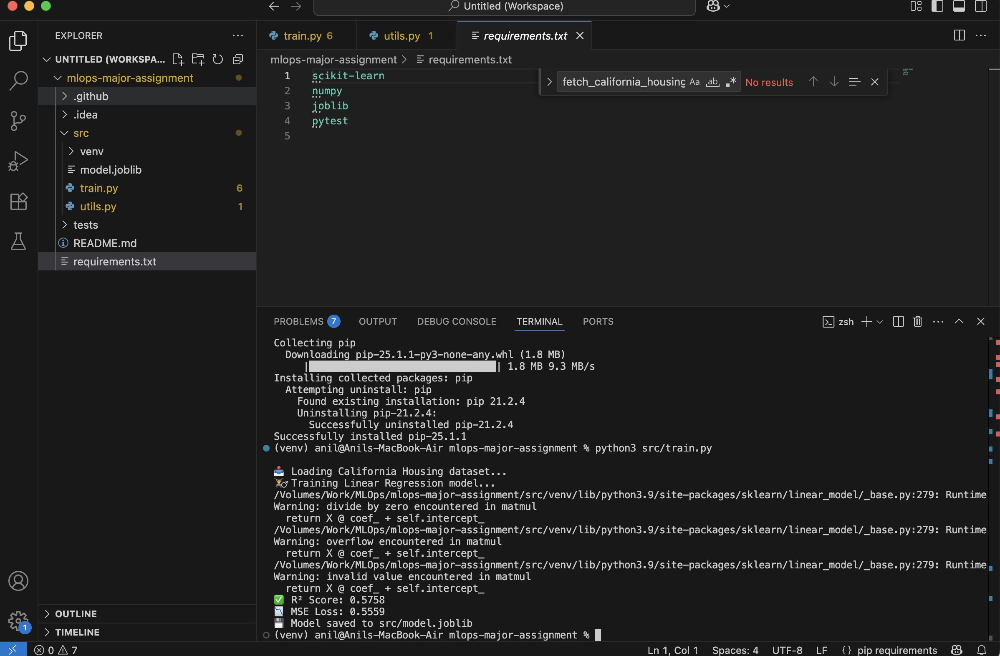
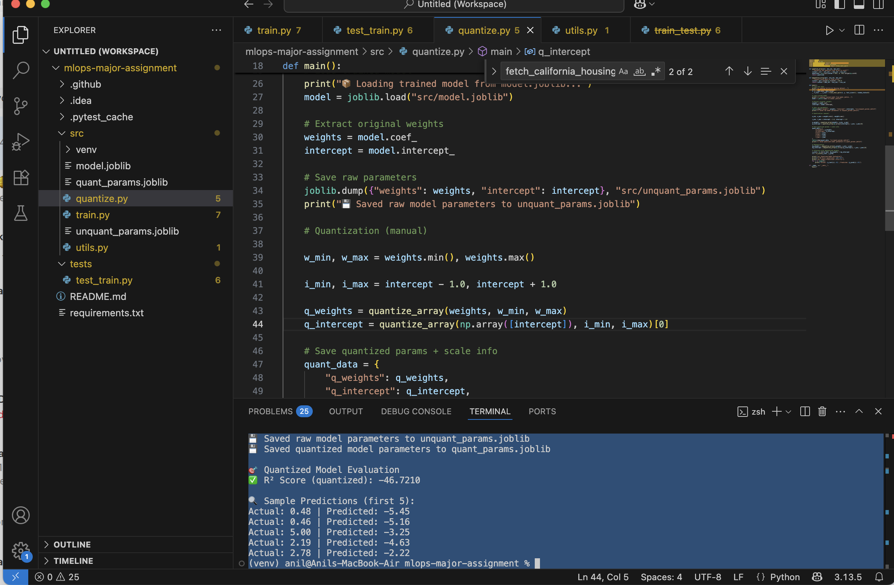
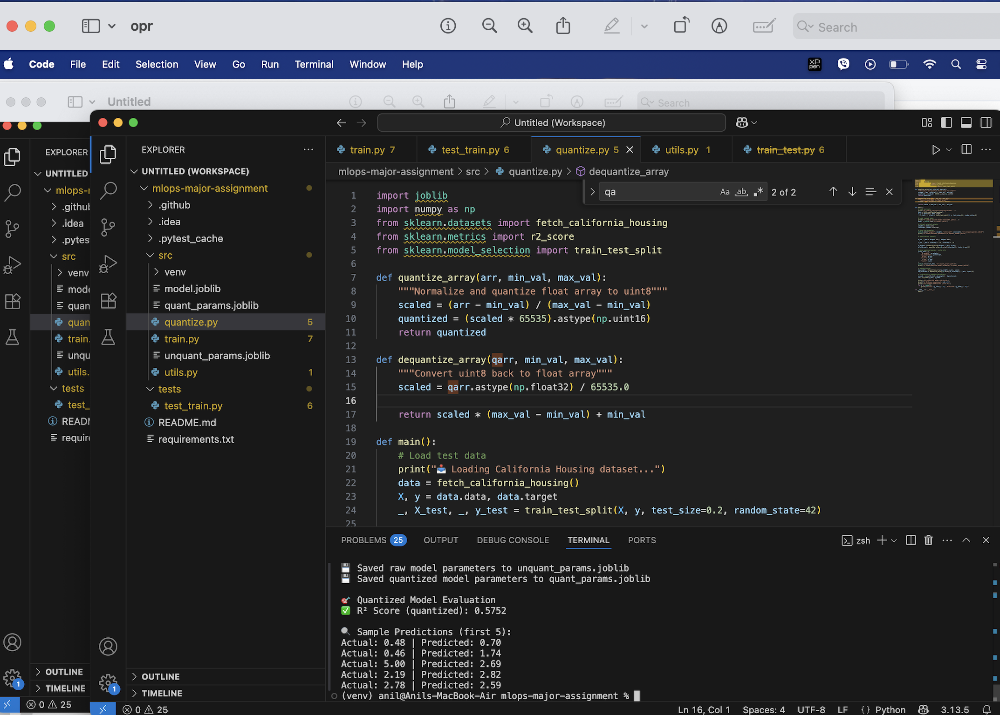
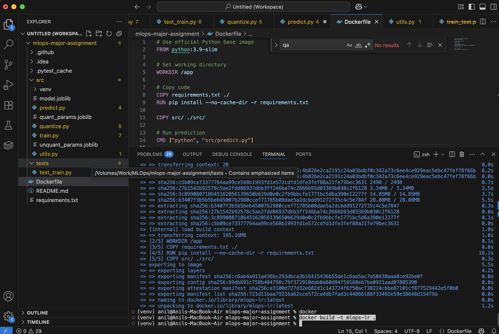
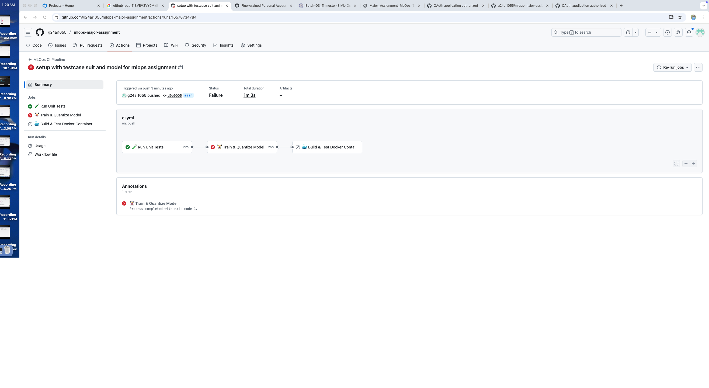
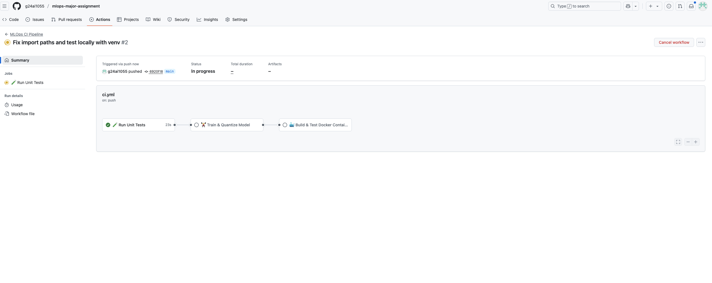
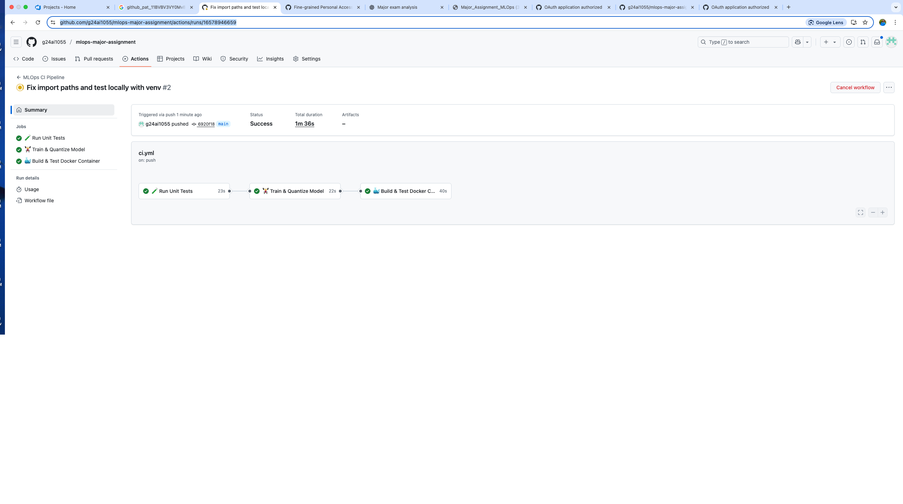

# 🧠 MLOps Major Assignment — California Housing Price Prediction 🏡

> 🚀 Built with PyTorch, Scikit-Learn, Docker, and GitHub Actions CI

This repository contains the implementation of a complete MLOps pipeline as part of the major exam assignment. The goal is to train, quantize, and deploy a simple machine learning model that predicts median house prices in California using the `fetch_california_housing` dataset.

✅ Highlights:
- Linear Regression training and evaluation  
- Manual model quantization (no PyTorch quant modules)  
- Automated testing with `pytest`  
- Dockerized deployment using `Dockerfile`  
- CI/CD workflow with GitHub Actions  
- Clean folder structure and unit-tested utilities  

📅 **Submission Deadline:** August 2, 2025, 11:59 PM IST  


---


## 📁 Project Structure

```text

mlops-major-assignment/
├── src/
│   ├── train.py              # Training and saving model
│   ├── quantize.py           # Manual quantization logic
│   ├── predict.py            # Predict using trained model
│   ├── utils.py              # Utility functions
│   ├── model.joblib          # Trained model (generated after training)
│   └── quant\_params.joblib   # Quantized parameters (generated)
│
├── tests/
│   └── test\_utils.py         # Unit tests for utilities
│
├── .github/workflows/
│   └── ci.yml                # GitHub Actions CI workflow
│
├── Dockerfile                # Docker build script
├── requirements.txt          # Python dependencies
└── README.md

````

---


---
## 📸 Screenshots


### 🔧 1. Module Installation (requirements.txt)


### 🔧 2. First Training Output (Non-Optimized) 


### 🔧 3. Optimised Training Output 


### 🔧 4. Code Push


### 🔧 5. Docker Image Build



### 🔧 6. Gihup Action Output ( 1 Failed )



### 🔧 7. Gihup Action Output ( Fixed and Processing )



### 🔧 8. Gihup Action Output ( All Passed )



```markdown
# 🧠 MLOps: Linear Regression with Quantization

[](https://github.com/g24ai1055/mlops-major-assignment/actions)

A simple end-to-end MLOps project that:

- Trains a Linear Regression model on the California Housing dataset
- Performs manual quantization
- Runs unit tests
- Builds a Docker container and tests predictions inside it
- Automates the pipeline via GitHub Actions

---


## 🚀 How to Run

### 💻 Locally

```bash
# Create and activate virtual environment
python3 -m venv venv
source venv/bin/activate

# Install dependencies
pip install -r requirements.txt

# Train the model
python src/train.py

# Apply quantization
python src/quantize.py

# Run prediction
python src/predict.py
````

---

### 🐳 Using Docker

```bash
# Build Docker image
docker build -t mlops-lr .

# Run prediction in container
docker run --rm mlops-lr
```

---

## ⚙️ GitHub Actions Pipeline

This project uses GitHub Actions to automate:

* ✅ Unit Tests via `pytest`
* ✅ Model Training & Saving
* ✅ Parameter Quantization
* ✅ Docker Build & Prediction Test

> Automatically runs on every push to `main`.

---

## 🧪 Run Tests

```bash
pytest tests/
```

---

## 📝 Sample Output

```
📥 Loading California Housing dataset...
🏋️‍♂️ Training Linear Regression model...
✅ R² Score: 0.5758
📉 MSE Loss: 0.5559
💾 Model saved to src/model.joblib

📊 Sample Predictions:
Actual: 0.48 | Predicted: 0.72
Actual: 0.46 | Predicted: 1.76
...
```

---

## 👨‍💻 Author

* GitHub: ANIL KUAMR  IIT JODHPUR
---

## 📄 License

This project is licensed under the **MIT License**.

```
---
